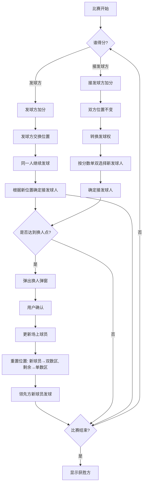

## Context

五羽伦比是五人团体赛制，采用50分或100分制，每10分进行一次选手轮换。核心挑战在于：
1. 精确追踪每位球员的场地位置（单数区/双数区）
2. 根据得分情况动态调整发球权和站位
3. 在换人节点同步重置所有场上球员位置

### 技术栈
- 前端：React + TypeScript + TailwindCSS
- 状态管理：React useState/useReducer
- 构建工具：Vite

### 参考规格
- `openspec/changes/five-round/specs/five-round-scoring.md` - 五羽伦比详细规则
- `openspec/changes/archive/2026-04-15-badminton-score-app/design.md` - 现有架构设计

## Goals / Non-Goals

**Goals:**
- 实现符合官方规则的发球/接发球逻辑
- 精确追踪场地位置变化
- 实现每10分的选手轮换与位置重置
- 提供清晰的UI反馈（发球标识、换人提示）

**Non-Goals:**
- 后端API集成
- 动画效果优化
- 多语言支持

## Decisions

### 1. 核心数据类型设计

```typescript
// 场地位置追踪
interface CourtPositions {
  evenCourtPlayer: string;   // 双数区球员名称
  oddCourtPlayer: string;    // 单数区球员名称
}

// 五羽伦比比赛状态（扩展）
interface WuYunLunBiMatchState extends WuYunLunBiMatchConfig {
  teamAScore: number;
  teamBScore: number;
  currentServerTeam: 'A' | 'B';
  currentServerPlayer: string;
  currentReceiverPlayer: string;
  
  // 新增：场地位置追踪
  teamACourtPositions: CourtPositions;
  teamBCourtPositions: CourtPositions;
  
  // 保留：当前场上球员索引（用于显示）
  currentPlayerIndices: {
    teamA: [number, number];  // [索引1, 索引2]
    teamB: [number, number];
  };
  
  isFinished: boolean;
  winner: 'A' | 'B' | null;
}
```

**Rationale**: 
- `CourtPositions` 直接映射到物理场地布局，便于计算发球/接发球对应关系
- 保留 `currentPlayerIndices` 用于UI显示当前上场的两名球员
- 分离位置追踪与球员索引，避免逻辑耦合

### 2. 核心算法：处理得分逻辑

#### 场景A：发球方得分

```typescript
function handleServerScores(state: WuYunLunBiMatchState): WuYunLunBiMatchState {
  const scoringTeam = state.currentServerTeam;
  
  // 1. 加分
  const newScore = scoringTeam === 'A' 
    ? state.teamAScore + 1 
    : state.teamBScore + 1;
  
  // 2. 发球方交换位置（单数区↔双数区）
  const updatedPositions = scoringTeam === 'A'
    ? {
        teamACourtPositions: swapCourts(state.teamACourtPositions),
        teamBCourtPositions: state.teamBCourtPositions, // 接发球方位置不变
      }
    : {
        teamACourtPositions: state.teamACourtPositions,
        teamBCourtPositions: swapCourts(state.teamBCourtPositions),
      };
  
  // 3. 发球人不变，但需要根据新位置确定接发球人
  const nextReceiver = getReceiverByServer(
    state.currentServerPlayer,
    scoringTeam,
    updatedPositions.teamACourtPositions,
    updatedPositions.teamBCourtPositions
  );
  
  return {
    ...state,
    teamAScore: scoringTeam === 'A' ? newScore : state.teamAScore,
    teamBScore: scoringTeam === 'B' ? newScore : state.teamBScore,
    ...updatedPositions,
    currentReceiverPlayer: nextReceiver,
  };
}
```

**规则依据**：
- 发球方得分后，发球方两人交换位置
- 同一人继续发球
- 接发球方位置不变
- 接发球人根据发球人所在区域确定（双数区对双数区，单数区对单数区）

#### 场景B：接发球方得分（发球方失分）

```typescript
function handleReceiverScores(state: WuYunLunBiMatchState): WuYunLunBiMatchState {
  const receivingTeam = state.currentServerTeam === 'A' ? 'B' : 'A';
  
  // 1. 加分
  const newScore = receivingTeam === 'A' 
    ? state.teamAScore + 1 
    : state.teamBScore + 1;
  
  // 2. 双方位置都不变
  // 3. 转换发球权
  // 4. 新发球方按分数单双选择发球人
  const scoringTeamPositions = receivingTeam === 'A' 
    ? state.teamACourtPositions 
    : state.teamBCourtPositions;
  
  const nextServerPlayer = newScore % 2 === 1
    ? scoringTeamPositions.oddCourtPlayer   // 单数分→单数区球员
    : scoringTeamPositions.evenCourtPlayer;  // 双数分→双数区球员
  
  // 5. 根据新发球人位置确定接发球人
  const nextReceiver = getReceiverByServer(
    nextServerPlayer,
    receivingTeam,
    state.teamACourtPositions,
    state.teamBCourtPositions
  );
  
  return {
    ...state,
    teamAScore: receivingTeam === 'A' ? newScore : state.teamAScore,
    teamBScore: receivingTeam === 'B' ? newScore : state.teamBScore,
    currentServerTeam: receivingTeam,
    currentServerPlayer: nextServerPlayer,
    currentReceiverPlayer: nextReceiver,
  };
}
```

**规则依据**：
- 接发球方得分后，双方位置都不变
- 发球权转移给得分方
- 新发球方根据加分后的比分单双性选择发球人
- 接发球人根据发球人所在区域确定

### 3. 核心算法：处理换人逻辑

```typescript
interface RotationInfo {
  isRotationPoint: boolean;
  benchedPlayers: Array<{
    team: 'A' | 'B';
    out: string;   // 下场球员名称
    in: string;    // 上场球员名称
  }>;
}

function detectRotationThreshold(
  scoreA: number,
  scoreB: number,
  totalPoints: number
): RotationInfo {
  const maxScore = Math.max(scoreA, scoreB);
  
  // 检查是否刚跨过10分阈值 (10, 20, 30...)
  if (maxScore === 0 || maxScore % 10 !== 0) {
    return { isRotationPoint: false, benchedPlayers: [] };
  }
  
  // 计算当前阶段（0-4对应10/20/30/40/50分...）
  const phase = (Math.floor(maxScore / 10) - 1) % 5;
  
  // 换人规则表 (基于索引)
  const rotationRules = [
    { out: [0, 0], in: [2, 2] },   // 10分: A1/B1下, A3/B3上
    { out: [1, 1], in: [3, 3] },   // 20分: A2/B2下, A4/B4上
    { out: [2, 2], in: [4, 4] },   // 30分: A3/B3下, A5/B5上
    { out: [3, 3], in: [0, 0] },   // 40分: A4/B4下, A1/B1上
    { out: [4, 4], in: [1, 1] },   // 50分: A5/B5下, A2/B2上
  ];
  
  const rule = rotationRules[phase];
  // ... 构造 benchedPlayers 信息
  return { isRotationPoint: true, benchedPlayers: [...] };
}

function applyRotation(
  state: WuYunLunBiMatchState,
  rotationInfo: RotationInfo
): WuYunLunBiMatchState {
  // 1. 更新场上球员索引
  const newIndices = calculateNewIndices(state.currentPlayerIndices, rotationInfo);
  
  // 2. 重置位置：新上场球员→双数区，剩余球员→单数区
  const newTeamAPositions = {
    evenCourtPlayer: state.teamA.players[newIndices.teamA[0]], // 新上场
    oddCourtPlayer: state.teamA.players[newIndices.teamA[1]],  // 剩余
  };
  
  const newTeamBPositions = {
    evenCourtPlayer: state.teamB.players[newIndices.teamB[0]],
    oddCourtPlayer: state.teamB.players[newIndices.teamB[1]],
  };
  
  // 3. 确定发球权：领先队伍的新球员发球
  const leadingTeam = state.teamAScore > state.teamBScore ? 'A' : 'B';
  const newServerPlayer = leadingTeam === 'A' 
    ? newTeamAPositions.evenCourtPlayer 
    : newTeamBPositions.evenCourtPlayer;
  
  // 4. 确定接发球人：落后队伍的新球员接发
  const receivingTeam = leadingTeam === 'A' ? 'B' : 'A';
  const newReceiverPlayer = receivingTeam === 'A'
    ? newTeamAPositions.evenCourtPlayer
    : newTeamBPositions.evenCourtPlayer;
  
  return {
    ...state,
    currentPlayerIndices: newIndices,
    teamACourtPositions: newTeamAPositions,
    teamBCourtPositions: newTeamBPositions,
    currentServerTeam: leadingTeam,
    currentServerPlayer: newServerPlayer,
    currentReceiverPlayer: newReceiverPlayer,
  };
}
```

**规则依据**：
- 领先队伍达到10/20/30/40分时触发换人
- 双方队伍同时换人
- 新上场球员进入双数区（发球/接发球位）
- 剩余球员进入单数区
- 领先队伍的新球员担任发球方

### 4. 辅助函数：确定接发球人

```typescript
function getReceiverByServer(
  serverPlayer: string,
  serverTeam: 'A' | 'B',
  teamACourts: CourtPositions,
  teamBCourts: CourtPositions
): string {
  // 判断发球人在哪个区域
  const serverCourts = serverTeam === 'A' ? teamACourts : teamBCourts;
  const isServerInEvenCourt = serverCourts.evenCourtPlayer === serverPlayer;
  
  // 接发球方是另一方
  const receiverCourts = serverTeam === 'A' ? teamBCourts : teamACourts;
  
  // 一一对应：双数区对双数区，单数区对单数区
  return isServerInEvenCourt
    ? receiverCourts.evenCourtPlayer
    : receiverCourts.oddCourtPlayer;
}

function swapCourts(positions: CourtPositions): CourtPositions {
  return {
    evenCourtPlayer: positions.oddCourtPlayer,
    oddCourtPlayer: positions.evenCourtPlayer,
  };
}
```

### 5. 组件设计

#### WuYunLunBiSetup.tsx

**职责**：
- 渲染A/B两队各5个名称输入框
- 实现发球/接发球选择的互斥逻辑
- 提供50分/100分单选按钮

**关键交互**：
```typescript
// 发球选择变更时，动态更新接发球可选范围
const handleServerChange = (serverPlayer: string) => {
  const serverTeam = serverPlayer.startsWith('A') ? 'A' : 'B';
  
  // 接发球只能从对方队伍的前2名中选择
  const availableReceivers = serverTeam === 'A'
    ? [config.teamB.players[0], config.teamB.players[1]]
    : [config.teamA.players[0], config.teamA.players[1]];
  
  // 方案A：自动清空接发球选择
  onConfigChange({ firstServerPlayer: serverPlayer, firstReceiverPlayer: '' });
};
```

**UI结构**：
- 两个卡片分别展示A队和B队的5个输入框
- 下拉选择框用于发球/接发球选择（接发球选项动态禁用不可选项目）
- 单选按钮组用于分数选择

#### WuYunLunBiMatch.tsx

**职责**：
- 可视化展示场地布局（单双数区）
- 显示发球/接发球标识
- 处理换人弹窗交互

**场地布局示意**：
```
┌─────────────────────────────┐
│       A双数区  │  A单数区    │
│   (发球位)     │            │
│   [A1] 发      │   [A2]     │
├─────────────────────────────┤
│       B单数区  │  B双数区    │
│                │   (接发位)  │
│   [B2]         │   [B1] 接   │
└─────────────────────────────┘
```

**换人弹窗逻辑**：
```typescript
const [showRotationModal, setShowRotationModal] = useState(false);
const [pendingRotation, setPendingRotation] = useState<RotationInfo | null>(null);

useEffect(() => {
  const rotationInfo = detectRotationThreshold(teamAScore, teamBScore, totalPoints);
  if (rotationInfo.isRotationPoint && !winner) {
    setPendingRotation(rotationInfo);
    setShowRotationModal(true);
  }
}, [teamAScore, teamBScore]);

const handleConfirmRotation = () => {
  if (pendingRotation) {
    const newState = applyRotation(currentState, pendingRotation);
    setState(newState);
    setShowRotationModal(false);
    setPendingRotation(null);
  }
};
```

**弹窗内容格式**：
```
换人提醒

A队：A1 下场 → A3 上场
B队：B1 下场 → B3 上场

[确认]
```

### 6. 状态流转图



## Risks / Trade-offs

- **风险**: 换人逻辑涉及位置重置，可能与现有得分逻辑冲突
  - **缓解**: 在换人后立即重新计算发球/接发球状态，确保一致性
  
- **风险**: 100分模式下换人规则需要循环处理
  - **缓解**: 使用模运算 `(score / 10 - 1) % 5` 确保正确循环
  
- **风险**: 用户可能在换人弹窗出现前快速连续得分
  - **缓解**: 在弹窗显示期间禁用得分按钮，防止状态混乱

## Open Questions

1. 是否需要支持暂停功能？
2. 换人弹窗是否需要倒计时自动关闭？
3. 是否需要记录每次换人的历史？
